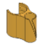

# ParastiPC - ダイソー板と3Dプリンタで作るラック寄生PC

Luminous Slim ラックに寄生するオープンフレームPCです。

ダイソーで売っているMDF板と3Dプリント造形品を使って作ります。

ポールの直径が公称値 25mm (実測では25.3mmだった) であれば、他のラックにも使えるかもしれません。

microATX と Mini-ITX のM/Bに対応しています (ATX の M/B には後日対応予定)。

板材を家庭で切るのはめんどいので、そのままの寸法で穴だけあけて使います。 百均の板は端っこがめくれていたり凹んだりしてることがありますが、それを考慮したパーツ設計となっています。

# ご注意

お約束ですが、**完全無保証**です。

このPCを組み立て、もしくは使用したことにより生ずるいかなる損害に対して、私は一切の責任を負いません。

したがいまして、組み立て中に指を切った、ドリルで床に穴をあけた、PC使用中に家が燃えた、CPUがオシャカになった、秘蔵のお宝画像が消えた、娘が感電した、ムスコが仮性包茎になった等、発生しうるすべてのトラブルは自己責任となります。

# 3Dプリント品のデータ

3Dプリンタで直接出力する場合は、[STL](https://github.com/hidsh/ParastiPC/tree/master/files/stl) をお使いください。 
3Dプリンタがない場合は、（高く付きますが）[DMM Make](https://make.dmm.com/shop/233090/) から造形品を購入することも可能です。

3Dモデルをいじったり、これを元に新しいバーツを作りたい方は [STEP](https://github.com/hidsh/ParastiPC/tree/master/files/step) をお使いください。

|    | イメージ    | 名称    | 個数 | ファイル (STL/STEP)     |
| -- | ---------- | -------- | ------------------------------- | --- |
| 1  |  | MDF穴あけ用ステンシル (PDF)          |1| stencil-mATX-MITX-MDF-6-300-400 |
| 2  |  | ケーブルガイドH             |1～2| cable-guide-h                |
| 3  |  | ケーブルガイドV             |1～2| cable-guide-v                |
| 4  |  | ホルダー左下      |1| holder-bottom-left              |
| 5  |  | ホルダー右下    |1| holder-bottom-right             |
| 6  |  | ホルダー左上            |1| holder-top-left                 |
| 7  |  | ホルダー右上          |1| holder-top-right                |
| 8  |  | (Optional) PCIeスロットカバー  |1| slot-cover                       |
| 9  |  | (Optional) 7mm厚 2.5” SSDマウンタ |1| ssd-mounter                    |
| 10 |  | (Optional) USBハブホルダー for [WITTIMES](https://www.amazon.co.jp/gp/product/B075R1Z9BY/)|1| usb-hub-holder               |

# その他のパーツ

M/B、CPU、ATX電源などの自作PCパーツのほかに、下記が必要となります。

| 名称                            | 用途                                        | 個数  | 参考/リンク  |
| ----------------------------- | -------------------------------------------- | -------------- | ------------ |
| MDF板 300x400 t=6  (要 穴あけ)            | M/B固定 穴あけ用の捨て板                   | 1 1  | ダイソー|
| ルミナスラック  スリーブ (ポール径 25mm用)| 左下/右下ホルダー固定         | 2            | [amazon](https://www.amazon.co.jp/gp/product/B000FHUAAI/)|
| インサートナット M3 L=3      | (Optional) 2.5” SSDマウンタ固定 (Optional) PCIeスロットカバー固定 (Optional) PCIeカード固定 | 4〜8 2 4 | [モノタロウ](https://www.monotaro.com/p/4210/8044/)|
| トラスねじ M3 L=10           | M/B固定（MDF裏側）                             | microATX: 9 Mini-ITX: 4      | [モノタロウ](https://www.monotaro.com/p/4168/4772/)|
| トラスねじ M3 L=15           | (Optional) 2.5” SSDマウンタ固定 (Optional) PCIeスロットカバー固定  | 4〜8 2 | [モノタロウ](https://www.monotaro.com/p/4168/4806/?t.q=%83g%83%89%83X%83l%83W%81%40m3)|
| 六角スペーサー M3 L=12 両端メス      | M/B 裏側 固定                 | microATX: 9 Mini-ITX: 4    | [モノタロウ](https://www.monotaro.com/p/0576/9602/?t.q=M3%20%98Z%8Ap%83X%83y%81%5B%83T%81%5B)|
| なべ小ねじ or サムスクリュー M3 L=7  | M/B 表側 固定  (Optional) PCIeカード固定 | microATX: 9 Mini-ITX: 4 4  | [amazon](https://www.amazon.co.jp/dp/B074TYYHR6/)|
| トグルスイッチ (2Pシングル OFF-ON モーメンタリ 挿し込み径 約12mm) | 電源スイッチ  | 1    | [ヤフオク](https://page.auctions.yahoo.co.jp/jp/auction/s749725358)  |
| 電源スイッチケーブル (切って使う)    | 電源スイッチ配線                      | 1       | [amazon](https://www.amazon.co.jp/gp/product/B019Z2O82E/)|
| Y端子                                  | 電源スイッチ配線                      | 2       | [モノタロウ](https://www.monotaro.com/p/6931/8384/)|
| メンディングテープ            | MDF穴あけ用ステンシルの貼付け                 | 2       | [amazon](https://www.amazon.co.jp/dp/B0013N1VCO)|

# 必要な工具
| 名称               | 用途                           | 参考/リンク                                   |
| ---------------- | ---------------------------- | ---------------------------------------- |
| プラスドライバー No.1    | ねじ締めいろいろ       | [amazon](https://www.amazon.co.jp/dp/B007R13ONK)   |
| 木工ドリル 4mm           | MDF板の穴あけ         | ダイソーにあるものでOK                             |
| 電動ドリル or 電動ドライバー | MDF板の穴あけ      | [amazon](https://www.amazon.co.jp/dp/B074H1YZ5L/)  |
| モンキーレンチ          | トグルスイッチ取付け    | [amazon](https://www.amazon.co.jp/dp/B00G8PS2AQ/)  |
| 圧着工具                | Y端子取付け (はんだ付けする場合は不要) | [amazon](https://www.amazon.co.jp//dp/B002JZXJFC/) |
| ラジオペンチ、ニッパー   | 3DP品のサポート剥ぎ取りなど                       |                                          |

# ビルドガイド

1. 電源スイッチケーブルにY端子を取り付ける 
1. 電源スイッチケーブルのY端子をトグルスイッチに接続する 
1. トグルスイッチを左下ホルダーに取り付ける 
1. (Optional)PCIeスロットカバーにインサートナットを押し込む　(6ヶ所) 
1. (Optimal) SSDマウンタにインサートナットを押し込む (4〜8ヶ所) 
    (入りにくいときは裏側からトラスねじを締め込んで入れる)　 
1. MDF穴あけ用ステンシルを原寸で A3 に印刷する 
    (コンビニで印刷する場合は原寸設定にご注意) 
1. ステンシルの左上の線をMDF板の角に合わせて、メンディングテープで固定する 
1. 穴位置にドリルの先端を押しつけ、印をつける (19ヶ所) 
1. ステンシルを剥がす 
1. 裏側に捨て板を敷いて、印の位置にドリルで穴を開ける 
1. MDF板の穴のおもて側に六角スペーサーを当て、裏側からトラスねじを差し込んで固定する 
    (穴位置がM/Bと干渉する場合は、そこの穴は省略する) 
1. M/Bを六角スペーサーの位置に合わせ、M3ねじで固定する 
1. (Optional) SSDマウンタをMDF板のおもて側の穴位置に合わせ、裏側からトラスねじで固定する 
1. (Optional) PCIeスロットカバーをMDF板のおもて側の穴位置に合わせ、裏側からトラスねじで固定する (2ヶ所) 
1. M/BにCPU、クーラー、メモリ等、PCパーツ一式を取りつける 
1. ラックのスリーブをポールにはめて、MDF板の下端が来る位置にセットする　(2ヶ所) 
1. 左下ホルダーと右下ホルダーをラックのポールに通し、スリーブにかぶせたあと、向かい合わせにする 
1. MDF板を左下ホルダーと右下ホルダーのミゾにセットする 
1. 左上ホルダーと右上ホルダーをラックのポールに通し、MDF板の上端をホルダーのミゾに奥まで挿し込んでMDF板を固定する 
1. ATX電源のケーブルをM/B、2.5”SSD、グラボなどに接続する 
1. (Optional) 2.5”SSDとM/Bを接続する  
1. 電源スイッチケーブルのヘッダ端子をM/Bに接続する 
1. キーボード、マウス、ディスプレイなどをM/Bに接続する 
1. 適宜、ケーブルガイドを取り付けて配線をまとめる 
1. 電源スイッチを入れて、PCを起動するッ！！！

**ビルドガイド用の写真を募集しています。プルリクエストもしくは、[DM](https://twitter.com/_gnrr)で写真だけ送りつけてもらっても結構です。**

# システム構成例

|||
|-----|-----|
|ラック| ルミナス スリム MH6015-4AN|
|M/B| B450M PRO4|
|CPU| Ryzen 5 3600 + Wraith Stealth Cooler|
|GPU| GTX 1070 G1 Gaming 8G|
|メモリ| W4U3200PS-16G|
|SSD M.2 | NVMe SA2000M8/1000G|
|SSD 2.5"| MZ-76Q1T0B/EC KLEVV NEO N500 120GB|
|電源| HEC-WNLT2-500W|
|3Dプリンタ/ フィラメント| Zortrax M200 Z-ABS v1|
|板| ダイソー MDF材 t6 300x400 !!!!|

# リンク

- [Thingiverse](https://www.thingiverse.com/thing:4538688)
- [DMM Make](https://make.dmm.com/shop/233090/)
